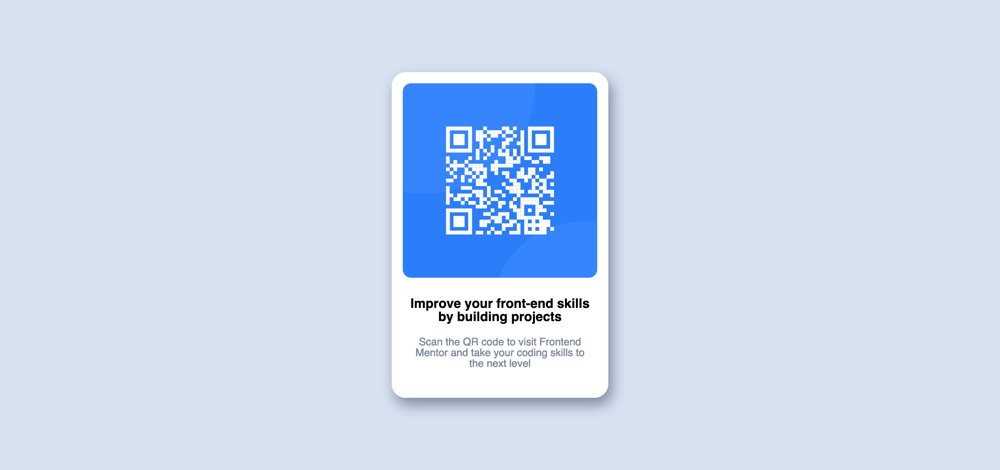

# Frontend Mentor - QR code component solution

This is a solution to the [QR code component challenge on Frontend Mentor](https://www.frontendmentor.io/challenges/qr-code-component-iux_sIO_H). Frontend Mentor challenges help you improve your coding skills by building realistic projects.

## Table of contents

- [Overview](#overview)
  - [Screenshot](#screenshot)
  - [Links](#links)
- [My process](#my-process)
  - [Built with](#built-with)
  - [Useful resources](#useful-resources)
- [Author](#author)

## Overview

### Screenshot

### Links

- Solution URL: [https://github.com/battistar/qr-code-component-main](https://github.com/battistar/qr-code-component-main)
- Live Site URL: [https://battistar.github.io/qr-code-component-main/](https://battistar.github.io/qr-code-component-main/)

## My process

### Built with

- Standard HTML, JS, CSS project
- Flexbox
- CSS BEM naming convention

### Useful resources

- CSS BEM naming convention: [https://www.freecodecamp.org/news/css-naming-conventions-that-will-save-you-hours-of-debugging-35cea737d849/](https://www.freecodecamp.org/news/css-naming-conventions-that-will-save-you-hours-of-debugging-35cea737d849/)

## Author

- Website - [Samuele Battistella](https://battistar.github.io/)
- Frontend Mentor - [@battistar](https://www.frontendmentor.io/profile/battistar)
